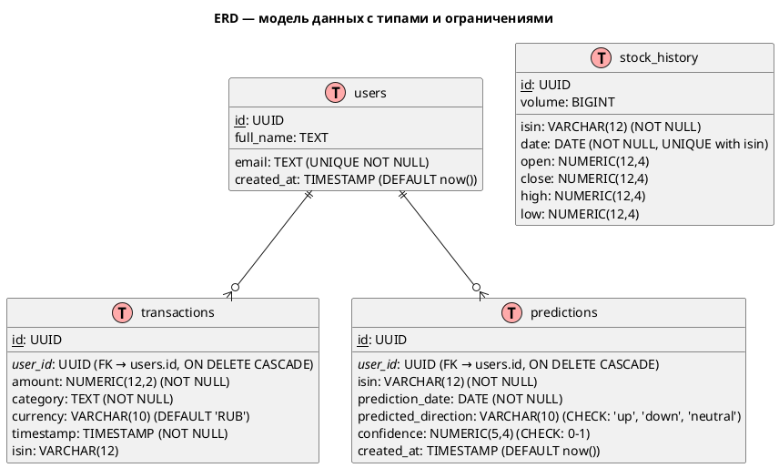

# RFC: Проектирование системы FinSight

## 1. Контекст

**FinSight** — это веб-приложение для отслеживания личных финансов и прогнозирования движения акций на основе технического анализа. Система интегрируется с публичным API Tinkoff Invest для получения данных о счёте пользователя, а также предоставляет простой машинно-обучающий сервис для прогноза краткосрочного движения акций (1–7 дней) по ISIN-коду.

---

## 2. Проблематика

Большинство частных инвесторов не имеют доступа к лёгким в использовании инструментам для анализа финансового состояния и прогнозирования движения активов. Приложение решает эту проблему путём объединения:
- Визуализации личных доходов и расходов.
- Простого API для анализа и предсказания рыночного поведения.
- Возможности расширения до полноценного инвестиционного помощника.

---

## 3. Терминология

| Термин       | Описание                                                                 |
|--------------|--------------------------------------------------------------------------|
| ISIN         | Международный идентификатор ценной бумаги.                              |
| Tinkoff API  | Публичный gRPC API для работы с инвестиционными данными.                |
| KNN          | Метод ближайших соседей — простой алгоритм машинного обучения.          |
| FastAPI      | Современный web-фреймворк Python для разработки API.                    |
| TA           | Technical Analysis — технический анализ, основанный на графиках и индикаторах. |
| MA/EMA       | Скользящие средние — один из базовых индикаторов тех. анализа.          |

---

## 4. Дополнительные материалы

- [Tinkoff API Docs](https://russianinvestments.github.io/investAPI/)
- [Python SDK](https://russianinvestments.github.io/investAPI/faq_python/)
- [TA-Lib (тех. индикаторы)](https://mrjbq7.github.io/ta-lib/)
- [Non-functional requirements (ByteByteGo)](https://blog.bytebytego.com/p/non-functional-requirements-the-backbone)

---

## 5. Сценарии использования

### 5.1 Сценарий 1 — Просмотр финансовой сводки

- **ID**: UC-01  
- **Актор**: Пользователь  
- **Название**: Просмотр финансов за выбранную дату  
- **Описание**: Пользователь запрашивает отображение баланса, доходов и расходов за указанную дату.
- **Схема**: _Будет добавлена через PlantUML_

---

### 5.2 Сценарий 2 — Прогноз цены по ISIN

- **ID**: UC-02  
- **Актор**: Пользователь  
- **Название**: Прогноз краткосрочного движения акций  
- **Описание**: Пользователь вводит ISIN, получает визуализированный прогноз с использованием KNN модели.
- **Схема**: _Будет добавлена через PlantUML_

---

### 5.3 Сценарий 3 — История транзакций

- **ID**: UC-03  
- **Актор**: Пользователь  
- **Название**: Просмотр доходов/расходов по дате  
- **Описание**: Отображение категорий доходов и расходов за выбранный период.
- **Схема**: _Будет добавлена через PlantUML_

---

## 6. Системные требования

### 6.1 Функциональные требования

| ID   | Приоритет  | Описание                                                                  |
|------|------------|---------------------------------------------------------------------------|
| FR-01 | must have | Интеграция с API Tinkoff Invest для получения данных о счёте             |
| FR-02 | must have | Отображение доходов и расходов по дате                                   |
| FR-03 | should have | Прогноз по ISIN с использованием ML-модели                             |
| FR-04 | should have | Визуализация данных (MA, EMA, свечи, и пр.)                            |

---

### 6.2 Нефункциональные требования

| ID   | Приоритет  | Описание                                                                  |
|------|------------|---------------------------------------------------------------------------|
| NFR-01 | must have | Ответ API не дольше 200ms при наличии кэшированных данных               |
| NFR-02 | must have | Хранение токенов доступа в зашифрованном виде                           |
| NFR-03 | should have | Расширяемая архитектура с поддержкой разных моделей ML                 |
| NFR-04 | should have | Отслеживание метрик и логов                                             |

---

## 7. Архитектура

### 7.1 C1 — Контекстная диаграмма

На диаграмме контекста отображены взаимодействия между пользователем, системой FinSight и внешним API Tinkoff Invest.


<details>
<summary>PlantUML код для генерации Контекстной диаграммы</summary>

```plantuml
@startuml C1_FinSight_Context

!include https://raw.githubusercontent.com/plantuml-stdlib/C4-PlantUML/master/C4_Context.puml

Person(user, "Пользователь", "Инвестор, использующий систему FinSight")
System(finsight, "FinSight", "Система анализа финансов и прогнозирования акций")

System_Ext(tinkoff_api, "Tinkoff Invest API", "API для получения инвестиционных данных")

Rel(user, finsight, "Взаимодействует через UI и API")
Rel(finsight, tinkoff_api, "Запрашивает данные о счете и котировках", "gRPC")

@enduml
```
</details>

---

### 7.2 C2 — Диаграмма контейнеров

На диаграмме контейнеров показано логическое разделение компонентов внутри системы FinSight: веб-приложение, ML-сервис, база данных, кэш, мониторинг и внешние зависимости.


<details>
<summary>PlantUML код для генерации диаграммы Контейнеров</summary>

```plantuml
@startuml C2_FinSight_Containers

!include https://raw.githubusercontent.com/plantuml-stdlib/C4-PlantUML/master/C4_Container.puml

Person(user, "Пользователь")

System_Boundary(finsight, "FinSight") {
    Container(api, "FastAPI Application", "Python + FastAPI", "Обрабатывает REST-запросы, координирует работу")
    Container(ml_service, "ML Service", "Python", "Сервис предсказаний на основе KNN модели")
    Container(db, "PostgreSQL", "СУБД", "Хранит пользователей, транзакции и историю предсказаний")
    Container(redis, "Redis", "Кэш", "Кэширует ответы от Tinkoff API и данные модели")
    Container(prometheus, "Prometheus", "Мониторинг", "Собирает метрики приложения")
}

System_Ext(tinkoff_api, "Tinkoff Invest API", "Инвестиционные данные через gRPC")

Rel(user, api, "REST-запросы")
Rel(api, tinkoff_api, "Получение инвестиционных данных", "gRPC")
Rel(api, ml_service, "Запрос на предсказание", "HTTP/gRPC")
Rel(api, db, "Чтение/запись данных", "SQL")
Rel(api, redis, "Кэширование")
Rel(api, prometheus, "Метрики")

@enduml
```
</details>

### 7.3 API стиль: REST

### 7.4 Аутентификация:
- OAuth2 + токен доступа Tinkoff Invest
- В будущем — JWT и RBAC

### 7.5 Модель БД (ERD)

Ниже представлена сущностно-атрибутная модель данных FinSight. Основными сущностями являются пользователи, транзакции, исторические котировки и предсказания.


<details>
<summary>PlantUML код для генерации ERD</summary>


</details>

Структура таблиц описана далее в SQL-формате:

<details>
<summary>Схема таблиц PostgreSQL</summary>

```sql
CREATE TABLE users (
    id UUID PRIMARY KEY,
    email TEXT UNIQUE NOT NULL,
    full_name TEXT,
    created_at TIMESTAMP DEFAULT now()
);

CREATE TABLE transactions (
    id UUID PRIMARY KEY,
    user_id UUID REFERENCES users(id) ON DELETE CASCADE,
    amount NUMERIC(12, 2) NOT NULL,
    category TEXT NOT NULL,
    currency VARCHAR(10) DEFAULT 'RUB',
    timestamp TIMESTAMP NOT NULL,
    isin VARCHAR(12)
);

CREATE TABLE stock_history (
    id UUID PRIMARY KEY,
    isin VARCHAR(12) NOT NULL,
    date DATE NOT NULL,
    open NUMERIC(12, 4),
    close NUMERIC(12, 4),
    high NUMERIC(12, 4),
    low NUMERIC(12, 4),
    volume BIGINT,
    UNIQUE (isin, date)
);

CREATE TABLE predictions (
    id UUID PRIMARY KEY,
    user_id UUID REFERENCES users(id) ON DELETE CASCADE,
    isin VARCHAR(12) NOT NULL,
    prediction_date DATE NOT NULL,
    predicted_direction VARCHAR(10) CHECK (predicted_direction IN ('up', 'down', 'neutral')),
    confidence NUMERIC(5, 4) CHECK (confidence >= 0 AND confidence <= 1),
    created_at TIMESTAMP DEFAULT now()
);
```
</details>

---

## 8. Технологический стек

| Компонент         | Технология       |
|------------------|------------------|
| Язык             | Python 3.13      |
| Веб-фреймворк     | FastAPI          |
| МЛ-библиотека     | scikit-learn     |
| СУБД             | PostgreSQL       |
| Кэш              | Redis            |
| Очередь          | Celery (в будущем)|
| CI/CD            | GitHub Actions   |
| Контейнеризация  | Docker           |
| Reverse Proxy    | Nginx            |
| Мониторинг       | Prometheus + Grafana |
| Хранение логов   | ELK stack        |
| Документация     | Docusaurus + LikeC4 |

---

## 9. API-дизайн

| Endpoint                | Метод | Запрос                         | Ответ                                 | Статусы       |
|-------------------------|-------|--------------------------------|----------------------------------------|----------------|
| `/account/summary`      | GET   | `?date=YYYY-MM-DD`            | JSON: баланс, доходы, расходы          | 200, 401, 500  |
| `/transactions`         | GET   | `?from=...&to=...`            | JSON: список транзакций               | 200, 401, 500  |
| `/predict`              | GET   | `?isin=...`                   | JSON: результат прогноза + график     | 200, 400, 500  |

---

## 10. План реализации

| Этап | Название                  | Что входит                                | Часы |
|------|---------------------------|--------------------------------------------|------|
| 1    | Подготовка проекта        | FastAPI, структура, конфиги                 | 4    |
| 2    | Интеграция Tinkoff API    | Клиент, модели, авторизация                | 6    |
| 3    | Работа с транзакциями     | Сервис учета и отображения                 | 6    |
| 4    | ML-модель (KNN)           | Подбор признаков, baseline, API            | 8    |
| 5    | Визуализация              | matplotlib/plotly, интеграция в UI         | 5    |
| 6    | Тесты и CI                | pytest, GitHub Actions, интеграция         | 5    |

---

## 11. Риски

| ID  | Описание                                               | Митигирование                    |
|-----|--------------------------------------------------------|----------------------------------|
| R1  | Недостаточная точность ML-модели                       | Обоснованный выбор модели, baseline |
| R2  | API Tinkoff изменится или будет нестабилен             | Кэширование, fallback механизмы  |
| R3  | Сложность масштабирования при добавлении пользователей | Архитектурная модульность        |

---

## 12. Тестирование

### Сценарии тестирования:

| ID  | Тип          | Сценарий                                           |
|-----|--------------|----------------------------------------------------|
| TC1 | Позитивный   | Успешный прогноз по ISIN                          |
| TC2 | Негативный   | Некорректный ISIN — ошибка 400                   |
| TC3 | Разрушительный | Проблемы в API Tinkoff — возврат 500            |
| TC4 | Позитивный   | Получение транзакций за выбранный период         |

---

## 13. Блок “Имплементация модели”

Для первой версии будет использоваться модель `KNeighborsClassifier` из библиотеки `scikit-learn`. Она подходит для baseline-решения, проста в реализации и интерпретации, не требует длительного обучения. Признаки будут рассчитаны с использованием технических индикаторов (MA, EMA, MACD и др.). Целевой признак — изменение цены за один день (рост/падение). Ожидаемая точность модели — 60–70%.

---

## 14. Пайплайны CI/CD

- **Lint + Typing**: `ruff`, `mypy`, `pre-commit`
- **Тестирование**: `pytest`, покрытие > 80%
- **Сборка образа**: Docker build, push to registry
- **Деплой**: на VPS с Docker Compose/docker-swarm

---
